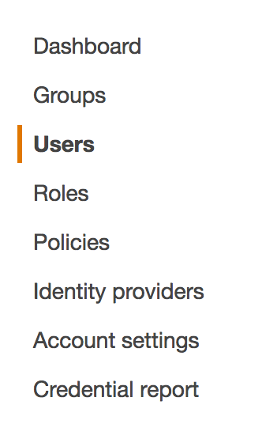
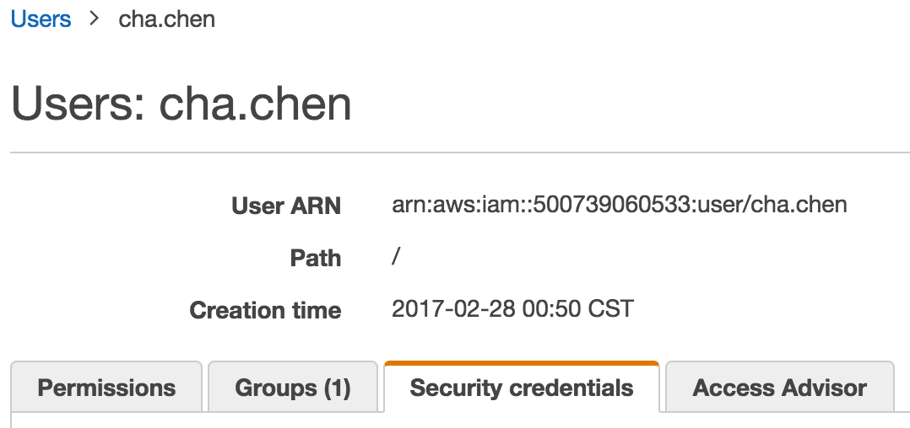
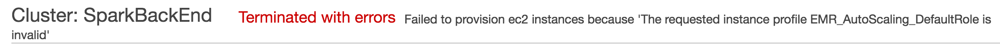

# AWS Spark (EMR) setup tutorial

**Goal**: 

- Concepts and Command Line Tutorial
- Build steps
- EMR Configuration
        
# Part I: Preparation 

## Basic Concepts

- **Root Account Credentials**: The email address and password that you provided when creating the account
- **Amazon Resources Namses (ARNS)**:  Uniquely identify AWS resources.
- **Role**: An AWS identity with permission policies that determine what the identity can and cannot do in AWS, However, instead of being uniquely associated with one person, a role is intended to be assumable by anyone needs it. (Compare with users)
  - Why? You can use roles to delegate access to users, applications, or services that don't normally have access to your AWS resources. EX. EMR instance needs to have the access to load new instance, access S3 storage, etc.
- **Instance Profiles**: A container for an IAM role that you can use to pass role information to an EC2 instance when the instance starts. 

**NOTE:** The instance profiles will automatically build when you build a new role, And the new instance profiles will use the same name as the role. (This may cause some problem, And can only be solved from aws cli)

## Command Line Tools
Some tasks and bug is only possible to be solved with aws cli. Also, It would be much easier to manage the AWS services.

### Install
```sh
pip install awscli
```

### How to set up
#### Create your access key
Download the <access key>.csv file. And you can find the aws\_access\_key\_id and the aws\_secret\_access\_key in it.
1. Goto the IAM console, And select the user tab.



2. Select your use name, goto your page. Then select security credentials tab.



3. Generate your access key.


### Configure your aws cli
#### Configure with command line
```sh
aws configure
```
Input your aws\_access\_key\_id and the aws\_secret\_access\_key.
### Edit the configuration file directly
```sh
vim ~/.aws/credentials
```
under [default] is your default account. [user name] your other account.

### Test
```sh
aws ec2 describe-instances --output table --region us-east-1
```

## Reference
- [IAM Users](http://docs.aws.amazon.com/IAM/latest/UserGuide/introduction_identity-management.html).
- [Amazon Command Line](http://docs.aws.amazon.com/cli/latest/userguide/cli-chap-welcome.html)
- [Instance Profiles](http://docs.aws.amazon.com/IAM/latest/UserGuide/id_roles_use_switch-role-ec2_instance-profiles.html)

# Part II: EMR Configuration
- Configuration for the EMR server (Software) 
    - Vendor: Amazon
    - Release: 5.3.1
    - Launch Mode: Cluster
    - S3: s3://aws-logs-500739060533-us-east-1/elasticmapreduce/fLyMd-mAkEr
- Configuration for the EMR server (Hardware)
    - Instance Type: m3.xlarge
    - Number of Instances: 3 (1 core 2 slaves)

## Asscess
- Key Park: SparkBackEnd.pem
- Permession: Default

## Build from CLI
Build new spark cluster with the aws cli also
```sh
aws emr create-cluster --applications Name=Ganglia Name=Spark Name=Zeppelin --ec2-attributes '{"KeyName":"SparkBackEnd","InstanceProfile":"EMR_DefaultRole","SubnetId":"subnet-14cf2e4d","EmrManagedSlaveSecurityGroup":"sg-2b48aa54","EmrManagedMasterSecurityGroup":"sg-2c48aa53"}' --service-role EMR_DefaultRole --enable-debugging --release-label emr-5.3.1 --log-uri 's3n://aws-logs-500739060533-us-east-1/elasticmapreduce/' --name 'SparkBackEnd' --instance-groups '[{"InstanceCouinput_saver_def_path = ""
    input_binary = False
    output_node_names = "output_node"nt":1,"InstanceGroupType":"MASTER","InstanceType":"m3.xlarge","Name":"Master Instance Group"},{"InstanceCount":2,"InstanceGroupType":"CORE","InstanceType":"m3.xlarge","Name":"Core Instance Group"}]' --configurations 
```
## Configuration
- Configuration for the EMR server (Software) 
    - Vendor: Amazon
    - Release: 5.3.1
    - Launch Mode: Cluster
    - S3: s3://aws-logs-500739060533-us-east-1/elasticmapreduce/
- Configuration for the EMR server (Hardware)
    - Instance Type: m3.xlarge
    - Number of Instances: 3 (1 core 2 slaves)
)

# Part III: BUG and Solution
## Invalid\_Default\_Role

### Cause
Instance profile is not exist.
 
### Solution
Generate a new instance profile.

### Reference:
- [Official Q&A](https://aws.amazon.com/premiumsupport/knowledge-center/emr-default-role-invalid/)
- [stackoverflow](http://stackoverflow.com/questions/28376095/aws-emr-cluster-fails-to-launch)
